<!-- BANNER - profile.sh --live (dithered portrait + system info). Generated by scripts/banner.py,
     source photo in assets/source/avatar.jpg. Run it by hand after changing either. -->
<picture>
  <source media="(prefers-color-scheme: dark)"  srcset="assets/banner-dark.svg">
  <source media="(prefers-color-scheme: light)" srcset="assets/banner-light.svg">
  
</picture>

 

<!-- NAME / TAGLINE - animated typing -->

 

<!-- SOCIALS - LinkedIn stays brand blue (glyph vanishes on custom fills). Others themed. -->
&nbsp;&nbsp;
&nbsp;&nbsp;
&nbsp;&nbsp;
&nbsp;&nbsp;

 

---

## whoami

Hi, I'm **Sarthak**, an AI engineer based in India 🇮🇳.
I build production-oriented AI systems, from data pipelines and model training to
LLM applications, retrieval, agents, and the backend infrastructure behind them.

- 🧠 **Working on AI-powered products and intelligent systems**: taking models out of notebooks and into things people actually use.
- 🔎 **Focused on LLMs, RAG, agents and inference**: retrieval that finds the right thing, and agents that do the right thing with it.
- 🎮 **Also build and ship indie games** at **[DarkLab Games](https://darklabgames.com)**.
- ✍️ Find me writing on **[Medium](https://medium.com/@sarthakagg567)** and experimenting on **[Kaggle](https://kaggle.com/sarthakaggarwal267)**.
- 🌱 **Currently learning:** `LLM Inference` · `Model Serving` · `AI Infrastructure` · `Distributed Systems` · `System Design`
- 💬 Ask me about **LLM/agent systems, RAG pipelines, or game dev** and I'll happily talk for hours.

 

## stack

  

---

## signals

<table>
<tr>
<td width="50%" align="center" valign="middle">

<!-- Self-rated radar - edit assets/skills.json, the workflow redraws it -->
<picture>
  <source media="(prefers-color-scheme: dark)"  srcset="assets/radar-dark.svg">
  <source media="(prefers-color-scheme: light)" srcset="assets/radar-light.svg">
  
</picture>

</td>
<td width="50%" align="center" valign="middle">

<!-- Language radar - pulled from GitHub by the workflow -->
<picture>
  <source media="(prefers-color-scheme: dark)"  srcset="assets/radar-langs-dark.svg">
  <source media="(prefers-color-scheme: light)" srcset="assets/radar-langs-light.svg">
  
</picture>

</td>
</tr>
</table>

---

## Numbers? The loss is going down, I promise.

<!-- Generated by scripts/generate.py into this repo, refreshed daily by
     .github/workflows/profile.yml. Deliberately NOT github-readme-stats /
     streak-stats: shared public instances go down and take the section with them. -->
<picture>
  <source media="(prefers-color-scheme: dark)"  srcset="assets/card-stats-dark.svg">
  <source media="(prefers-color-scheme: light)" srcset="assets/card-stats-light.svg">
  
</picture>

  

<picture>
  <source media="(prefers-color-scheme: dark)"  srcset="assets/card-languages-dark.svg">
  <source media="(prefers-color-scheme: light)" srcset="assets/card-languages-light.svg">
  
</picture>

---

` built with tensors & chai · @sarthak98765 `

